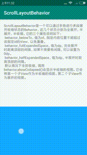

BehaviorMaster
===

[  ](https://bintray.com/msdx/maven/BehaviorMaster/_latestVersion)

BehaviorMaster提供一些CoordinatorLayout的Behavior扩展，以实现一些特定的交互需求。

# 依赖

```groovy
implementation 'com.githang:behavior-master:0.1'
```

# library中的自定义behavior

## ScrollLayoutBehavior 

停车王主界面停车场信息展示。



**属性**

- `behavior_halfExpandedSpace` dimen 半展开时距离顶部的空间
- `behavior_fullExpandedSpace` dimen 全展开时距离顶部的空间
- `behavior_belowTo` id 全展开时位于哪个控件之下。如果不设置，则全展开时顶部空间使用fullExpandedSpace